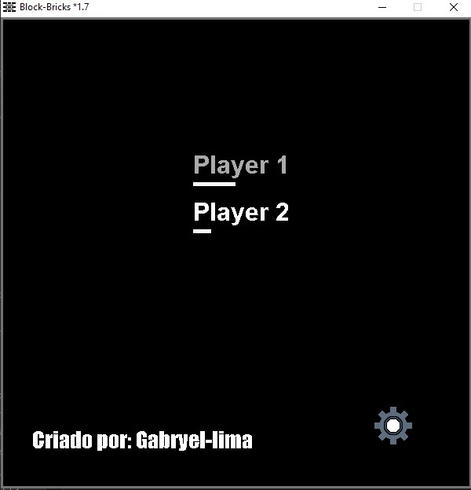
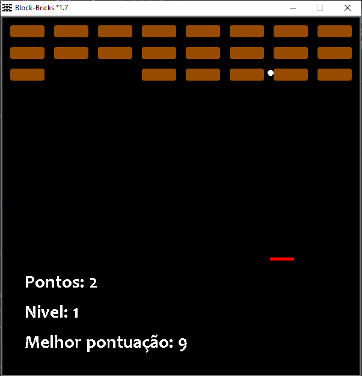
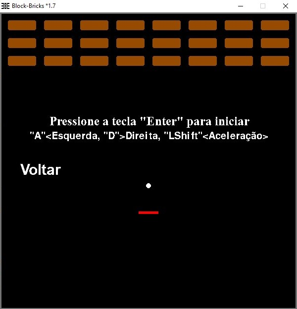
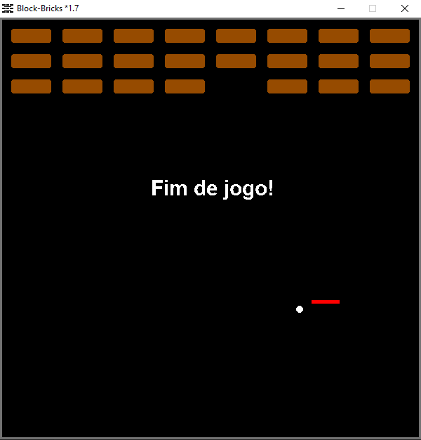

# Block-Bricks (Almost an Arkanoid)

Welcome to Block-Bricks, a Python reimagining of the classic game Arkanoid, where players must interact with a ball and blocks to complete levels. This project also explores the integration of machine learning techniques, including reinforcement learning and evolutionary strategies, to optimize gameplay.

## Features

- Recreated the classic game in Python, with Pygame.
- Custom reinforcement learning environment (`CustomPyEnvironment`) for developing intelligent game-playing agents.
- Evolutionary agent (`EvolutionaryAgent`) that learns and optimizes game interactions.

## Game Backend

The game backend includes logic for controlling the paddle, ball dynamics, collision detection, and interaction with blocks. The backend has been specifically designed to support reinforcement learning, making it possible for an agent to learn how to play the game autonomously. The game state is represented as normalized frames, allowing easy integration with ML models.

## Documentation and Related Projects

For more detailed information about specific components of the project, check out the following documents:

- [Detailed Game Documentation](./README.md): Provides an in-depth explanation of the game's backend, mechanics, and strategies used to enhance gameplay.
- [Evolutionary Agent Documentation](./EvolutionaryAgent.md): Explains the implementation of the Evolutionary Agent and how it enhances reinforcement learning performance.

## Custom Reinforcement Learning Environment

The `CustomPyEnvironment` is a specialized implementation of the `PyEnvironment` provided by `TF-Agents`. This environment includes the following features:

- **Action Space**: Move left, move right, or fine-tune paddle position.
- **Observation Space**: A normalized frame of the game screen, allowing the AI to understand the current game state.
- **Reward System**: Rewards for aligning the paddle with the ball, destroying blocks, and avoiding ball drops, encouraging skillful gameplay.

## Evolutionary Agent

The `EvolutionaryAgent` introduces evolutionary algorithms to enhance reinforcement learning for the Block-Bricks game. Detailed coverage of the agent's implementation can be found in the [Evolutionary Agent Documentation](./EvolutionaryAgent.md).

The Evolutionary Agent features:

- **Population Initialization**: Creates a population of simple neural networks.
- **Evaluation and Selection**: Selects the best-performing networks based on reward scores.
- **Crossover and Mutation**: Combines weights from high-performing networks and applies mutations for variation.
- **Fitness Tracking**: Monitors the performance of agents over multiple generations.

## License

This project is licensed under the MIT License. See the [LICENSE](LICENSE) file for more information.

## Contributions

Contributions are welcome! Feel free to open issues or pull requests with improvements or suggestions.

## Contact

If you have questions or are interested in collaborating, feel free to reach out:

- **Email**: [gabbryellimasi@gmail.com](mailto:gabbryellimasi@gmail.com)

---

# Machine Learning Study Applied to Block-Bricks

This document explains the study of machine learning applied to the game Block-Bricks, focusing on reinforcement learning and evolutionary learning techniques. The project draws inspiration from the book **"Hands-On Machine Learning with Scikit-Learn, Keras, and TensorFlow" by Aurélien Géron**.

## Modifying the Game Backend

The game is a Python recreation of Arkanoid, where players interact with a ball and blocks. The backend was adapted to support reinforcement learning by adding functionality for reward calculation, detailed game state observations, and defining possible actions for the agent.

The game logic, encapsulated in a `Game` class, handles paddle movements, collision detection, and state maintenance, making it easy to integrate reinforcement learning techniques.

## `CustomPyEnvironment`

The `CustomPyEnvironment` is a custom implementation of the `PyEnvironment` from `TF-Agents`, providing a framework for RL algorithms to interact with the game. This environment includes action and observation specifications, as well as reward logic that incentivizes the agent to play effectively.

### `CustomPyEnvironment` Highlights

- **Action and Observation Specification**: Defines a three-action space—move left, move right, and fine adjustment—with observations represented as normalized frames.
- **Reward and Penalty System**: Encourages the agent to align the paddle with the ball, destroy blocks, and avoid losing the ball.
- **Reset and Step Methods**: Implements methods to reset the environment and progress game steps, suitable for reinforcement learning training.

## Evolutionary Agent (`EvolutionaryAgent`)

The `EvolutionaryAgent` is an innovative application of genetic algorithms to train a model interacting with the `CustomPyEnvironment`. This approach was inspired by the **"Hands-On Machine Learning"** book, exploring genetic algorithms as a lightweight alternative to gradient-based training.

### How the Evolutionary Agent Works

- **Initial Population**: Individuals are neural networks initialized with random weights.
- **Evaluation and Selection**: Evaluates individuals based on total rewards accumulated, with the best-performing networks forming an elite group.
- **Crossover and Mutation**: Creates new individuals through crossover of elite members and random mutations to ensure diversity.
- **Fitness History**: Tracks the best individuals across generations, saving the top model for future use.

## Results and Reflections

The `EvolutionaryAgent` was effective in gradually improving gameplay over multiple generations, learning to keep the ball in play and destroy blocks efficiently. While evolutionary methods can be computationally intensive, their simplicity and ability to find solutions without gradients make them appealing for this project.

## Conclusion

This study demonstrates the potential of integrating reinforcement learning and evolutionary algorithms in a game environment. Using concepts from **Aurélien Géron's book**, we successfully developed an agent capable of continuously improving its gameplay. Evolutionary algorithms proved to be a viable training method, especially in scenarios where gradient-based methods are impractical.

For additional information on the main project, refer to the [Main README](./README.md).

---

# Block-Bricks Overview

## Description

Block-Bricks is a 2D puzzle game implemented in Python using Pygame, inspired by classic block-clearing games. Players must eliminate groups of blocks to clear the board. The game is designed to be both fun and challenging, offering a great way to test your puzzle-solving skills.

The project is continually evolving, with AI integration currently in progress. The AI aims to autonomously interact with the game, demonstrating machine learning's potential in enhancing gameplay experiences.

## Screenshots (v1.7 - Old Version)

## Gameplay Video

[Watch Gameplay Video](https://youtube.com/shorts/uduFYOvi9fA)

## License

The source code and game assets for Block-Bricks are copyrighted and licensed under the [LICENSE](https://github.com/Gabryel-lima/Block-Bricks/blob/master/LICENSE).

## Usage Restrictions

1. This game and its source code are provided solely for learning and entertainment purposes. Commercial use is not allowed without prior authorization.
2. You are welcome to study, modify, and enhance the game's code for personal use. However, any modifications or enhancements should not be publicly distributed without authorization.
3. Redistribution, either in whole or in part, requires written authorization from the copyright owner.
4. The game is provided "as is," with no warranty. The copyright owner is not liable for any damages or consequences arising from its use.

## Contributions

Contributions are encouraged! If you would like to suggest improvements or fix bugs, please reach out before submitting a pull request to discuss your changes.

## Contact

For questions, special permissions, or additional information, please contact the copyright owner:

**Email**: [gabbryellimasi@gmail.com](mailto:gabbryellimasi@gmail.com)

## Learn More

For a deeper dive into the game's backend and reinforcement learning integration, please see the [Block-Bricks Documentation](./Block-Bricks.md).
